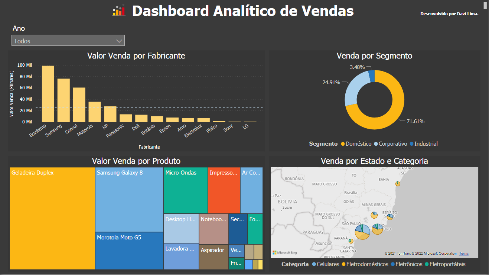

# Utilizando Power BI para gerar Dashboard Analítico de Vendas
*Projeto de Business Intelligence. Os dados aqui presente são apenas fictícios para estudo./*

  

## Análise das necessidades:
  O objetivo da aplicação dos metodos de BI nesse projeto são  para obter os seguintes conhecimentos:
* Desempenho das vendas de uma empresa:
1. Qual dos fabricantes dos produtos vendidos, apresenta melhor desempenho nas vendas?
2. Qual o total de vendas por segmento?
3. Quais os produtos que foram mais vendidos?
4. Qual o total de vendas por Estado e Categoria?

## As ferramentas utilizadas:

* Power BI: Power BI é uma ferramenta de Business Intelligence, disponibilizada pela Microsoft, com intuito de tratar,modelar, analisar e visualizar dados.

## Modelagens:
   Nessa fase, o objetivo é definir o escopo para a criação do modelo. O modelo escolhido para a modelagem foi o esquema estrela, composta por dimensões e fato, no qual tem como principal vantagem a fácil visualização dos dados e redução do número de Joins.

### Tabela dimensão:
* Dimensão Loja: Dimensão onde é encontrado informações das lojas. Tendo como chave primária código da loja e atributos cidade e estado.

* Dimensão Produto: Dimensão onde é encontrado informações sobre os produtos. Tendo como chave primária o código do produto e os atributos categoria, fabricante, produto e segmento.

* Dimensão Calendário: Dimensão onde é encontrada atributos data (dia/mês/ano) e ano em que cada dimensão é analisada.

* Dimensão Vendedor: Dimensão onde é encontrado os vendedores. Tendo como chave primária código do vendedor e o atributo vendedor.
e atributos modelo, cor, fabricante do veículo.

### Tabela Fato: 
* Fato venda: Fato onde é encontrada as chaves primárias das dimensões, código da loja, código do produto, código do vendedor, código da data. Para as quais podem se navegar e analisar as informações desejadas. Este fato consiste também em a medida.

*p1-business-intelligence/Processos de ETL/*

 * As respectivas tabelas DIM_Loja, DIM_Produto, DIM_Vendedor, correspodem da fonte de origem, seguido pela limpeza e transformação com Power Query, responsável por converter os tipos de dados e realizar a limpeza de valores nulos e duplicados.
 
 * A tabela FATO_Venda, no fluxo de dados foi utilizado o Power Query para limpeza e transformação possibilitando realizar o relacionamento com as tabelas de dimensão.

*p1-business-intelligence/Analise_Multidimensiona/*

## Desenvolvimento dos Dashboards:
Após ter passado pela obtenção de dados, tratamento, carregamento a fim de tornar os dados limpos e coerentes, a última etapa do processo BI é o desenvolvimento do dashboard para a visualização dos dados que possam responder as questões levantadas nas necessidades do negócio.

## Resultados Obtidos:

* **Desempenho dos Fabricantes:** É possível observar que o desempenho do Fabricante Brastemp comparado as outras empresas entre o período de 2012-2015 foi de 99.208.30 sendo assim a que apresentou o melhor desempenho nesse período.

* **Desempenho de Venda por Segmento:** Os indicadores visuais aqui expostos revelam que o segmento Doméstico representa 71,61% do faturamento do período de 2012-2015.

* **Desempenho de Venda Produto:** Os indicadores visuais aqui expostos revela a Geladeira Duplex é a que possui o maior faturamento sendo de 121,824.32.

* **Desempenho por Estado e Categoria:** Os indicadores visuais aqui expostos revelam que os Estados de São Paulo e Rio de Janeiro são os que mais possuem registros de vendas.

